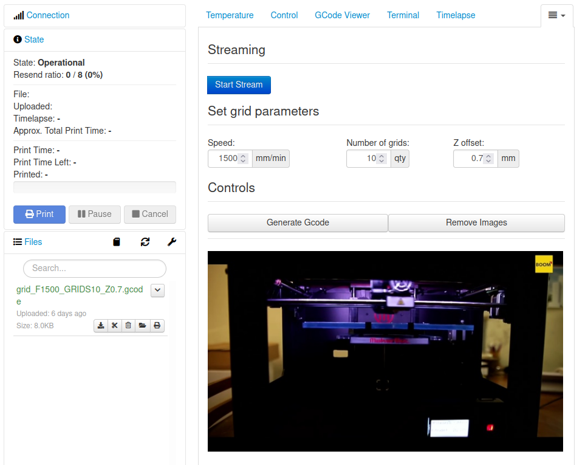
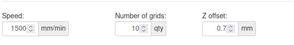

# OctoPrint-GridCam

OctoPrint plugin to stream and save images.

## Requirements

1. Python 3, plugin was tested with Python 3.8.10
2. OpenCV 
   1. To install OpenCV do
   ```bash
   sudo apt-get install python3-opencv
   
   # Test
   python3
   import cv2
   ```
3. NumPy
   ```bash
   python3 -m pip install numpy
   ```
## Installation

1. Install OctoPrint if not installed
```bash
git clone https://github.com/OctoPrint/OctoPrint
cd OctoPrint
python3 -m pip install -e .[develop,plugins]

# Test
octoprint --help
```
2. Install the plugin. Run the following in the terminal:
```bash
git clone https://github.com/kanstancin/OctoPrint-GridCam.git
cd OctoPrint-GridCam
octoprint dev plugin:install
```

## How to use

1. Start Octoprint
```bash
octoprint serve
```





2. Start streaming to test if camera works (optional)
   1. Go to ```GridCam``` tab in Octoprint and click ```Start Stream``` button

3. Generate gcode for the grid
   1. Set gcode parameters (for the first run default parameters should be good)

   

   2. Click "Generate Gcode" button. Gcode file should appear in "gcodes/" folder.

4. Connect printer and upload the gcode file from 
```OctoPrint-GridCam/gcodes/``` folder
5. Start printing, images should appear in ```OctoPrint-GridCam/images/``` folder

## Virtual video streaming (optional) 

1. run OBS, select video and stream
2. run ```bash rtm_to_http.sh```
3. connect to webcam over ```http://localhost:8888/videostream.cgi```
